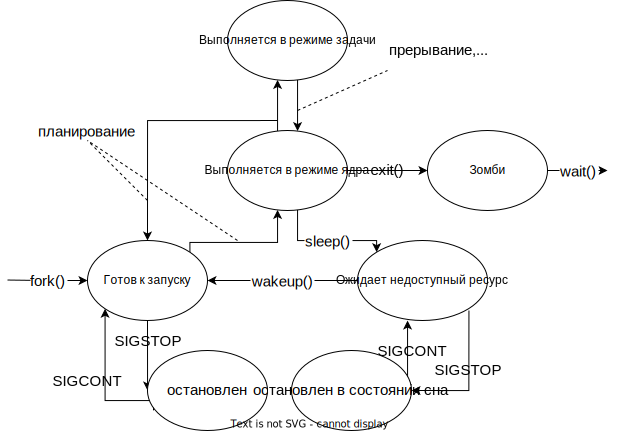

# Процессы, демонизация процессов

## Понятие процесса
При запуске программы на выполнение создается процесс - самодостаточная единица вычислительной работы. В ОС Linux 
структура процессов древовидная, все процессы могут быть порождены только другими процессами. При старте ОС создается
процесс ядра - корень дерева процессов.

Процессу предоставляется отдельное виртуальное адресное пространство, чтобы различные процессы не могли вмешиваться в 
коды и данные других процессов. Средства межпроцессного взаимодействия предоставляются ОС, они будут рассмотренны позже.

Каждый процесс в системе имеет:
- уникальный идентификатор процесса (pid) - целое положительное число
- идентификатор родительского процесса, который инициировал запуск текущего процесса (ppid)
- степень привелегированности
- место нахождения кодового сегмента
- состояние процесса
- ...

Также из-за необходимости прерываний и возобновлений процесса для него хранится контекст процесса - информация о 
состоянии операционной среды (состояние регистров, указатели на открытые файлы, ...). Используется он только при 
выполнении вычислений процессом.

Процесс содержит потоки, в простейшем случае - один поток. Потоки процесса выполняют отдельные вычислительные работы 
и разделяют между собой ресурсы системы. Все потоки одного процесса имеют общую область ОЗУ, находятся в одном адресном 
пространстве: используют общие файлы, устройства, общий стек.

## Цикл жизни процесса
Процесс в каждый момент времени находится в одном из состояний, процесс можнт переходить из одного состояния в другое. 
Множество состояний делится на 
- пассивные - когда процесс не имеет возможности использовать процессорное время
- активные - когда процессорное время выделено для процесса

Когда процесс готов к выполнению и нуждается в процессорном времени, он находится в состоянии *готовность*. Такие процессы
образуют очередь готовых процессов. Также процесс может *ожидать* событие. В состоянии *выполнения* может в один момент 
времени находиться только один процесс. Переход из состояния выполнения инициируется либо самим процессом, освобождающим
ресурс из-за необходимости ожидания, либо операционной системой, распределяющей кванты процессорного времени. 

Поведением процесса можно управлять сигналами - программными прерываниями, посылаемыми при возникновении события. 
Система определяет набор сигналов, которые могут быть отправлены процессу. В Linux сигнал представляется целочисленным 
значением. Когда сигнал приходит, по таблице указателей функций в структуре описания процесса выясняется, как нужно 
реагировать на этот сигнал.

Реакцией на сигналы может быть:
- вызов собственной функции обработки;
- игнорирование сигнала;
- использование функции обработки по умолчанию.

Игнорирование сигнала неприменимо для `SIGKILL`

Сигналы могут отправляться системой, текущим и другими процессами (`raise(int sig)` `kill(pid_t pid, int sig)`), в 
том числе из командной строки. 

*Процессы-зомби возникают, если потомок завершился, а родительский процесс не вызвал wait().
Операционная система оставляет процесс зарегистрированным в своей внутренней таблице данных, пока родительский процесс
не получит кода возврата потомка, либо не закончится сам.*

## Порождение процесса
Порождение включает в себя два этапа: 
- формирование необходимых структур данных для описания процесса, заполнение этих структур данными исходного процесса
- замена кодового сегмента порожденного процесса
Для создания процессов используются системные вызовы:  `fork()` и `exec()`.

### fork
`pid_t fork(void);` 

порождает новый процесс, создает для него новое адресное пространство, которое идентично исходному адресному 
пространству, таким образом мы получаем два одинаковый процесса. 

После возврата из `fork()`, который происходит и в родительский процесс, и в порожденный, оба процесса начинают 
выполнять одну и ту же инструкцию. В исходном процессе `fork()` возвращает PID порожденного процесса, если порождение 
прошло успешно, и значение -1 при возникновении ошибки. В порожденном процессе она возвращает 0. На основании этой 
информации можно обработать разделение поведения потомка и родителя. 

Порожденный процесс наследует от родителя следующие данные:
- сегменты кода, данных и стека программы;
- таблицу файлов, в которой находятся состояния флагов дескрипторов файла, указывающие, читается ли файл или пишется. 
Кроме того, в таблице файлов содержится текущая позиция указателя записи-чтения;
рабочий и корневой каталоги;
- реальный и эффективный номер пользователя и номер группы;
- приоритеты процесса (администратор может изменить их через nice);
- управляющий терминал терминал;
- маску сигналов;
- ограничения по ресурсам;
- сведения о среде выполнения;
- разделяемые сегменты памяти.

### exec

Обычно подразумевается, что потомок должен сменить свою программу на другую, это достигается с помощью системного 
вызова:

`int exec..(...)`

В процессе замещается код новыми инструкциями, загружаемыми из указанного исполняемого файла.  Переданная в качестве 
аргумента программа загружается в память вместо старой, которая вызвала exec. Старой программе больше не доступны 
сегменты памяти, которые перезаписаны новой программой.

## Демонизация процесса. Понятие демона

Для создания демона необходимо породить новый процесс, завершить родительский процесс и настроить контекст и 
дескриптор демонизируемого процесса. Последовательность шагов следующая:
1. Порождение процесса -`fork()`
2. Завершение родителького процесса - `exit()`
3. Задать демону новую группу процессов и сеанс, в котором демон будет ведущим процессом - `setsid()`. После создания 
нового сеанса демон не имеет управляющего терминала
4. Изменить рабочую директорию на root, чтобы старая директория перестала зависить от демона и могла быть изменена, и 
закрыть файловые дескрипторы - `chdir()` и `close(i)`
5. Открыть файловые дескрипторы 0, 1 и 2 стандартного потока ввода, вывода и ошибок

